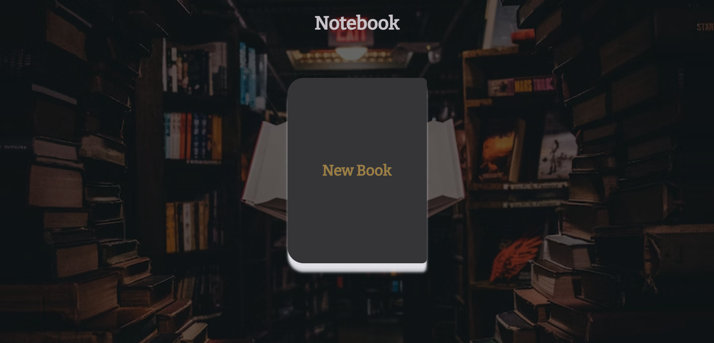
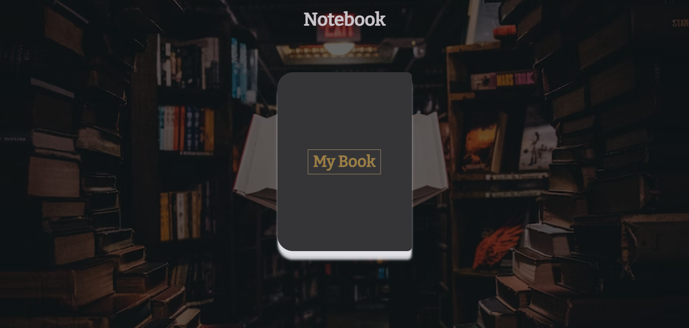
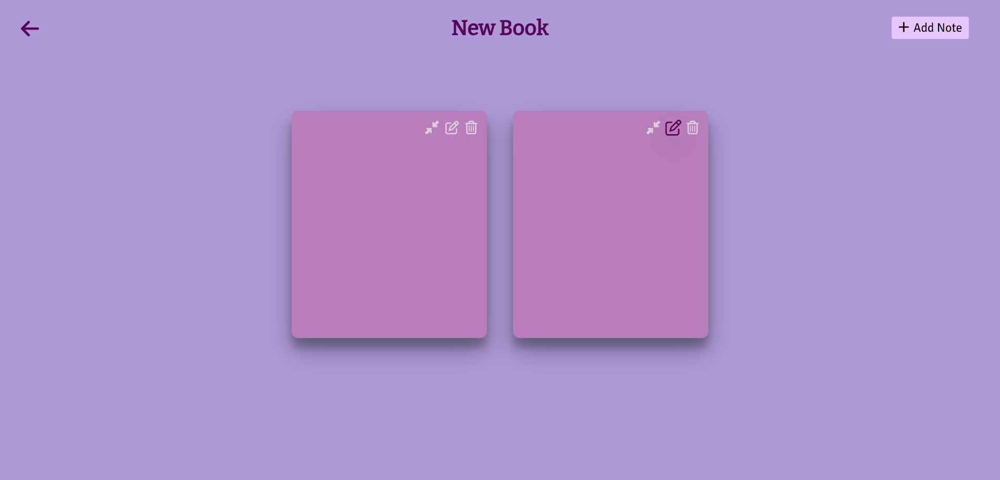
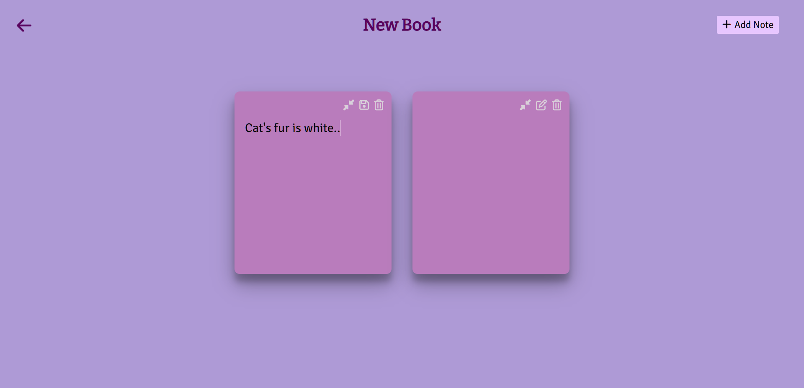

# Notebook

#### Description:

This web app is a simple notebook that allows you to take notes and store them locally. The app has two pages:

The first page is a notebook. You can rename it by clicking on the name.

The second page is a notes page. The heading of the notes page is the title of the notebook that you double clicked on. You can add, edit, delete, and save notes on this page. You can also maximize the width of a note to have a better view.

The data that you enter as notes is stored in local storage with the book title.

To add a new book, simply change the title of the notebook on the first page. To check previous books, give the same title to the book and double click on it. The notes that you entered previously will be stored as the name of the book that you mentioned.

#### Features:

- Take notes and store them locally.
- Rename and store as seperate books.
- Add, edit, delete, and save notes.
- Maximize the width of a note to have a better view.

#### How to use:

- Go to the notebook web app.
- Give a title to the book then double click on it.
- Click on the "+" button to add a note.
- Add, edit, delete, or save notes by clicking on the corresponding buttons.
- Click on the "Back" arrow to create new book or view previously created books.
- Enter the same title to view its notes or give new title to create new book.

## Demo

Watch the demo video on [YouTube](https://youtu.be/SCX0O3LJfl8).

## Tech Stack

**Front End :** HTML, CSS, JavaScript

**IDE:** Visual Studio Code

#### Visit Website: https://note-book-kvs.netlify.app/

